# 🚀 AWS Week 1 Infrastructure Deployment Project


## 📖 Project Overview

This project demonstrates the deployment and configuration of AWS core infrastructure services including IAM, S3, EC2, EBS, Networking (ENI), and AMI-based replication.

The objective was to design, secure, deploy, and validate a cloud infrastructure environment similar to real-world production setups.

---

# 🔐 1️⃣ IAM Configuration

### ✔ Tasks Performed
- Created IAM User
- Generated Access Key
- Created custom S3 ReadOnly policy
- Created IAM Role for EC2
- Created IAM group with ReadOnlyAccess

### 📸 Screenshots

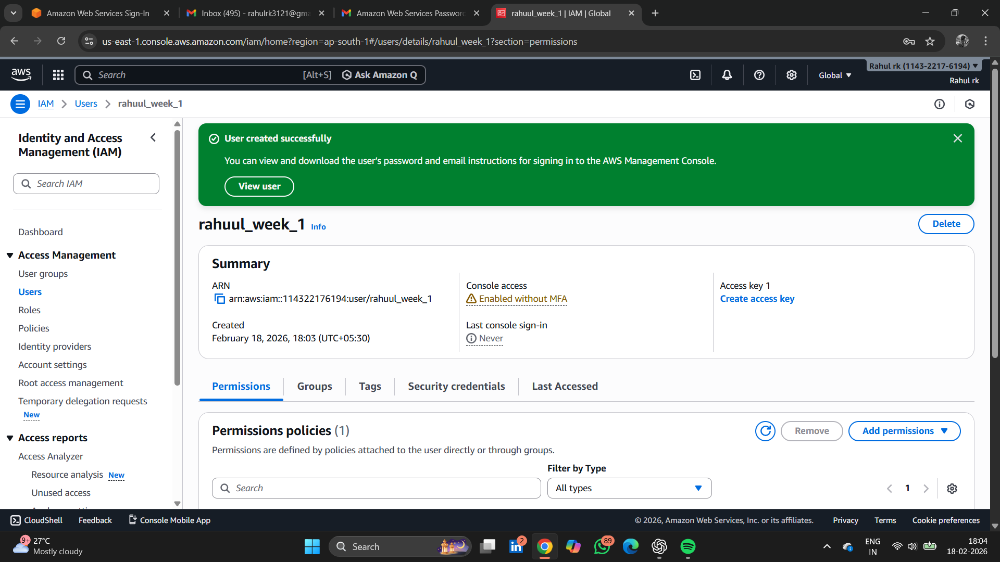

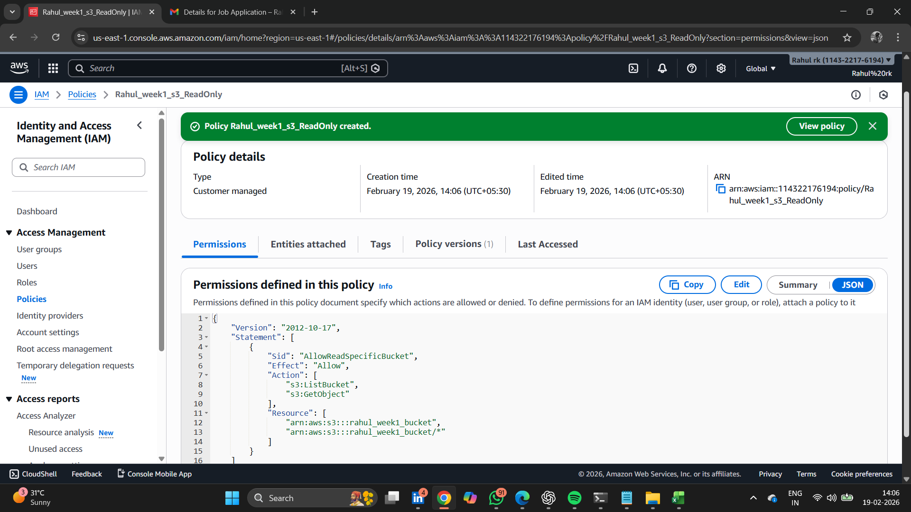

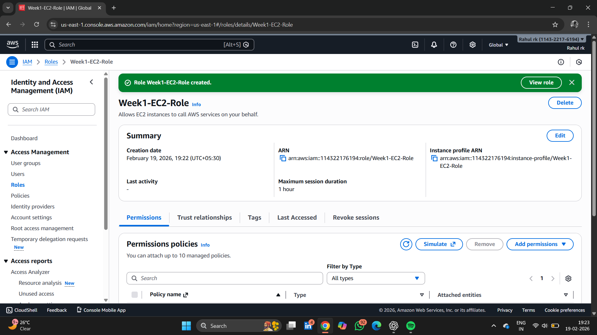


---

# 🪣 2️⃣ S3 Bucket Setup

### ✔ Tasks Performed
- Created S3 bucket: `rahul-week1-bucket`
- Attached custom read-only policy
- Verified using AWS CLI

### 📌 Command Used

```bash
aws s3 ls s3://rahul-week1-bucket
```

### 📸 Screenshots

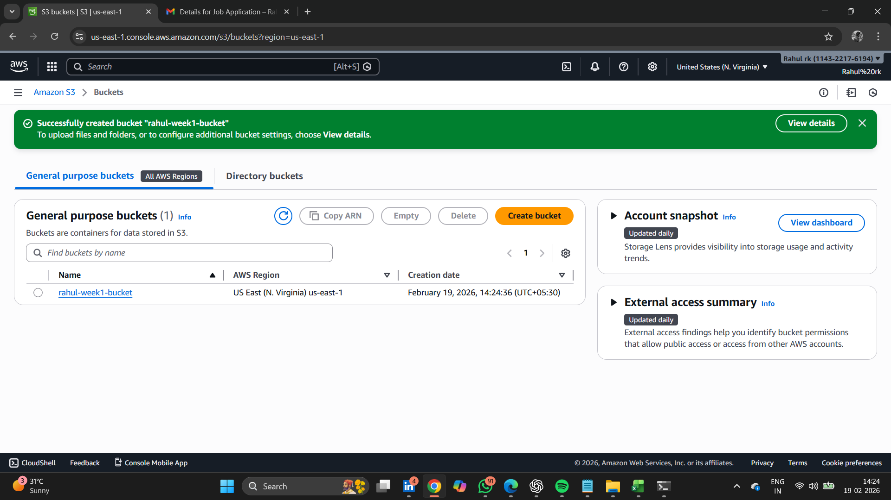

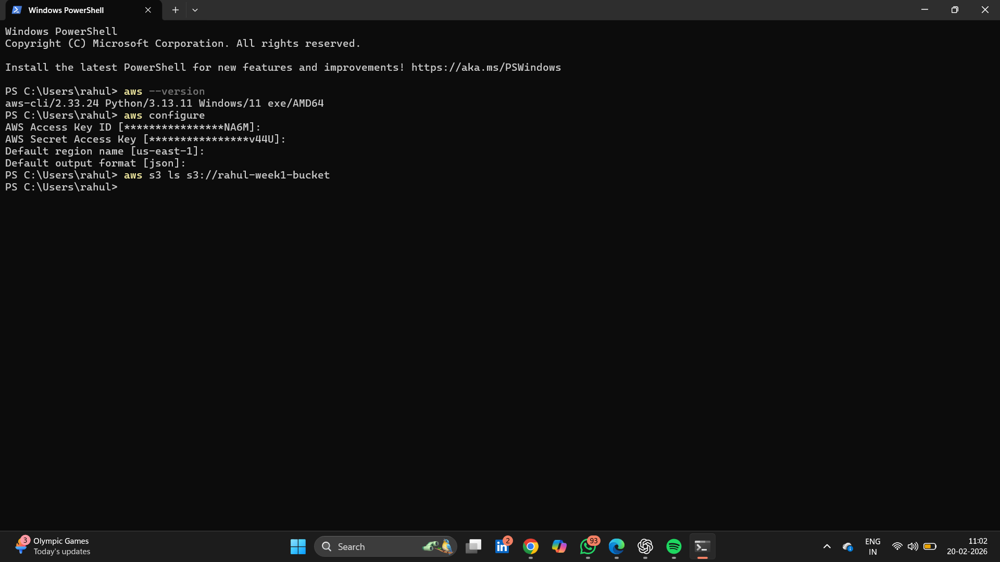

---

# 🖥 3️⃣ EC2 Instance Deployment

### ✔ Configuration
- Amazon Linux 2023
- t2.micro (initial)
- Upgraded to t2.medium
- Security Group configured (22 & 80)
- IAM Role attached

### 📸 Screenshot

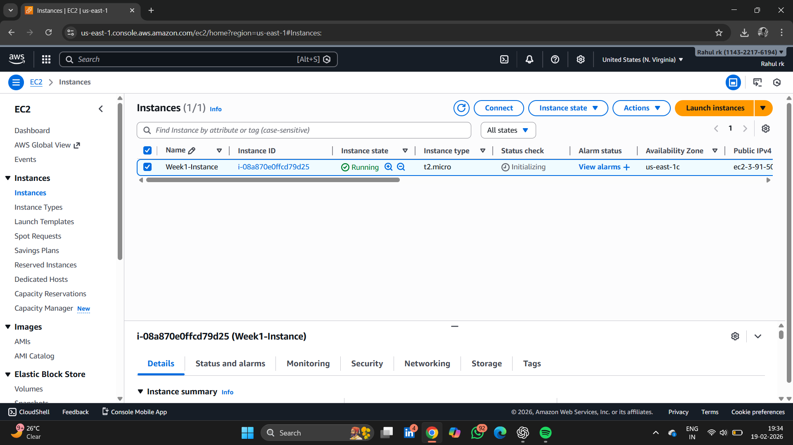

---

# 💾 4️⃣ EBS Volume Resize

### ✔ Tasks Performed
- Increased root volume from 30GB → 50GB
- Verified XFS filesystem

### 📌 Command Used

```bash
lsblk -f
```

### 📸 Screenshot

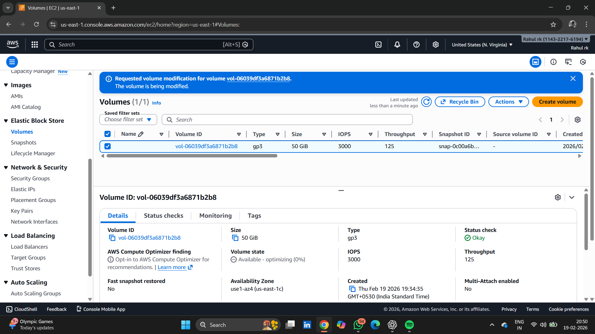

---

# 🌐 5️⃣ Elastic Network Interface (ENI)

### ✔ Tasks Performed
- Created custom ENI
- Attached ENI to EC2
- Verified successful attachment

### 📸 Screenshots

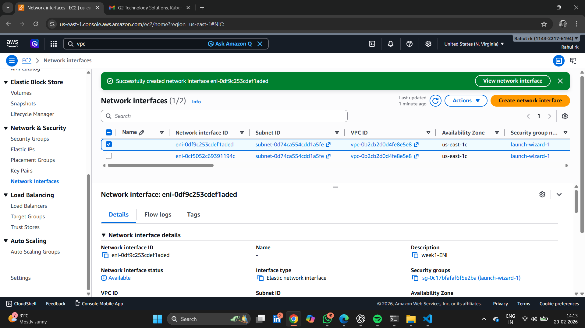

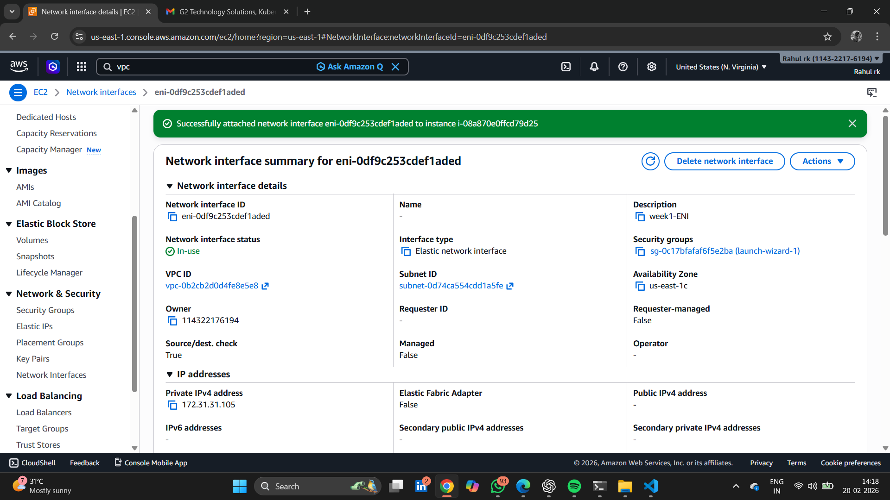

---

# 🌍 6️⃣ Apache Web Server Setup

### ✔ Tasks Performed
- Installed Apache (httpd)
- Started & enabled service
- Created custom webpage
- Verified using Public IP

### 📌 Commands Used

```bash
sudo yum install httpd -y
sudo systemctl start httpd
sudo systemctl enable httpd
echo "Hello from Week1 Project" | sudo tee /var/www/html/index.html
```

### 📸 Screenshots

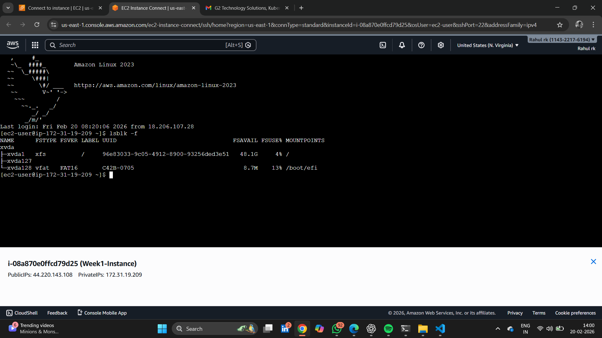

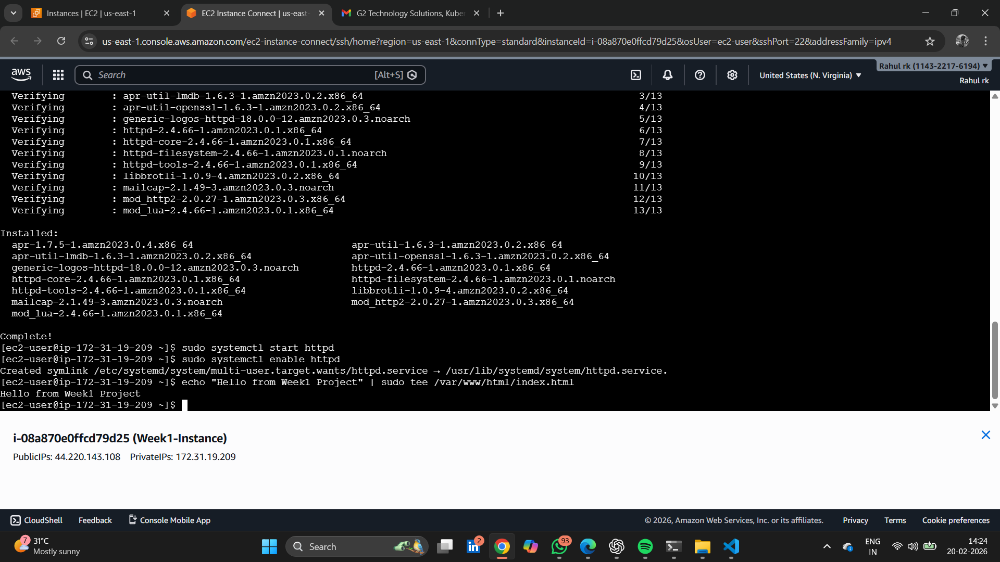

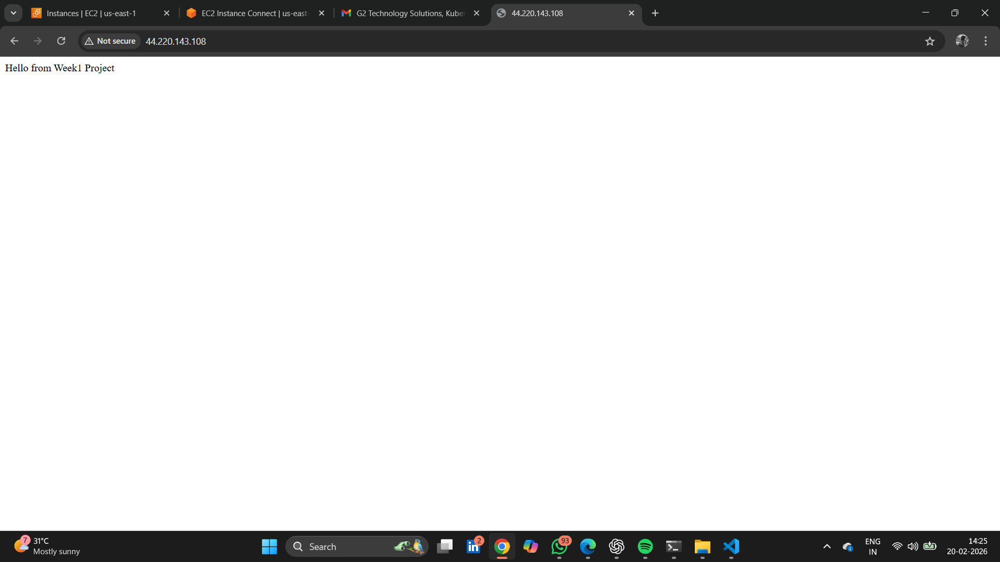

---

# 📦 7️⃣ AMI Creation & EC2 Replication

### ✔ Tasks Performed
- Created AMI from configured instance
- Launched 2 replica EC2 instances
- Verified instances running successfully

### 📸 Screenshots

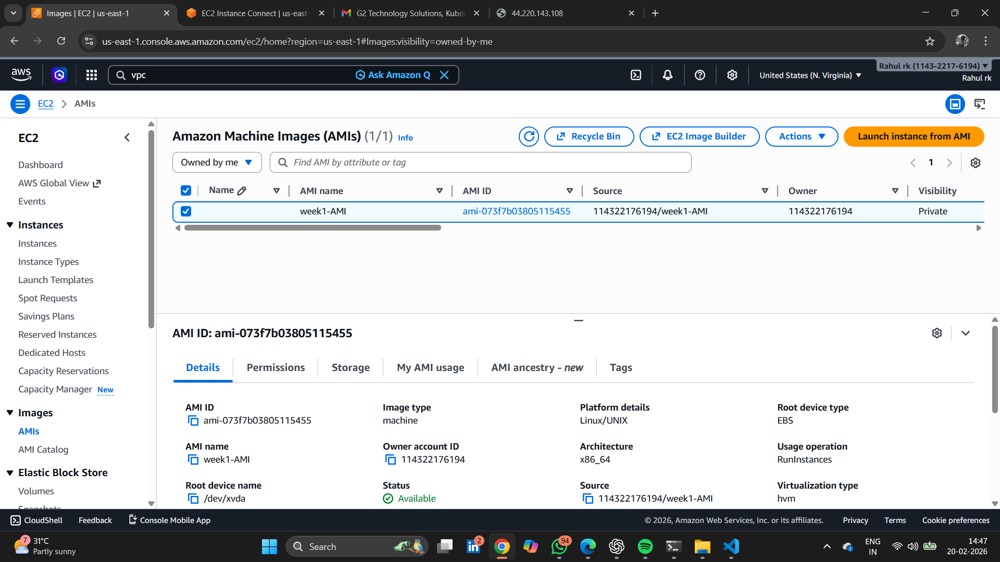


---

# 🎯 Final Outcome

Successfully deployed and validated a complete AWS infrastructure environment including:

- Secure IAM setup
- Controlled S3 access
- EC2 web server deployment
- EBS storage expansion
- Custom networking configuration
- AMI-based instance replication

---

# 🧠 Skills Demonstrated

- AWS IAM Security Best Practices
- S3 Policy Configuration
- AWS CLI Usage
- EC2 Provisioning
- Linux Server Administration
- Apache Deployment
- EBS Volume Management
- ENI Networking
- AMI & Instance Replication

---

# ⚠️ Security Notice

All access keys and sensitive credentials have been rotated or removed before publishing this repository.

---

# 📌 Conclusion

This project demonstrates practical, hands-on AWS infrastructure deployment skills and foundational cloud engineering capabilities.

